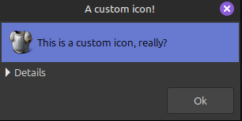
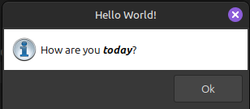
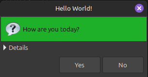
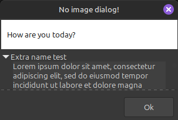
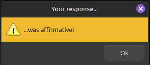
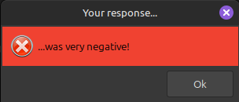

## DIALOG

A simple message dialog package. 

### Usage:

This package needs GoTK3 (GTK) to run (see link below), and you will need to run gtk.Init() somewhere in your application, before using the dialogs. 
```go
	// Initialize gtk
gtk.Init(&os.Args)

_, _ = dialog.Title("A custom icon!").
    Text("This is a custom icon, really?").
    Extra(getLongText()).
    ExtraHeight(200).
    CustomIcon("./example/assets/armour.png").
    HeaderColor("#6879D0FF").
    OkButton().
    Size(300, 50).
    Show()

_, _ = dialog.Title("Hello World!").
    TextMarkup("<span foreground=\"black\">How are you <i><b>today</b></i>?</span>`5").
    InfoIcon().
    OkButton().
    Size(300, 100).
    Show()

_, _ = dialog.Title("No image dialog!").
    Text("How are you today?").
    Extra(getLongText()).
    ExtraHeight(50).
    ExtraName("Extra name test").
    OkButton().
    Height(100).
    Show()

response, _ := dialog.Title("Hello World!").
    Text("How are you today?").
    Extra(getLongText()).
    ExtraHeight(50).
    QuestionIcon().
    YesNoButtons().
    Height(125).
    Show()

if response == gtk.RESPONSE_YES {
    _, _ = dialog.Title("Your response...").
    Text("...was affirmative!").
    WarningIcon().
    OkButton().
    Show()
} else {
    _, _ = dialog.Title("Your response...").
    Text("...was very negative!").
    ErrorIcon().
    OkButton().
    Show()
}
```
# IMAGES

 

 

 


# LINKS
* Source of inspiration: https://github.com/sqweek/dialog
* GoTK3 : https://github.com/gotk3/gotk3
# TODO
* Choose between smaller and larger icons. Currently probably only look ok if the icons are 32x32 (PNG).
* Handle line breaks in text

